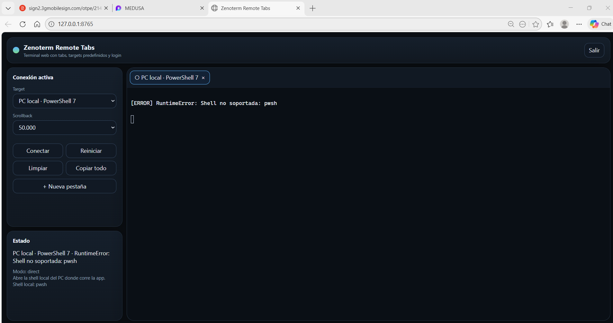
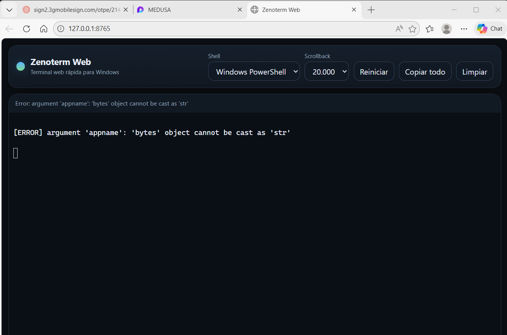
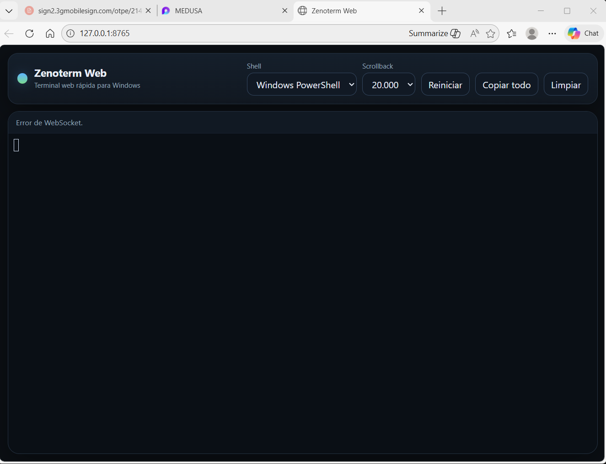

# Zenoterm Remote Tabs

Zenoterm Remote Tabs es una aplicación web para **abrir y operar terminales interactivas desde el navegador** sobre un equipo Windows que actúa como host de ejecución. El proyecto está orientado a un uso práctico y directo: arrancas `app.py`, se levanta un panel web, haces login y desde ahí puedes abrir **múltiples pestañas de terminal**, cada una conectada a un destino predefinido.

La aplicación soporta tres modos de conexión:

- **`direct`**: abre una shell local del propio PC Windows donde está corriendo la app.
- **`ssh_password`**: abre una terminal remota SSH usando usuario fijo del target y **contraseña efímera** introducida al conectar.
- **`ssh_key`**: abre una terminal remota SSH usando **clave privada predefinida en la configuración** y, si hace falta, **passphrase efímera**.

El proyecto está planteado como un **modelo 3**: los destinos se definen en configuración, pero las credenciales sensibles se introducen en el momento de conectar y no se exponen como parte de la interfaz normal de navegación. Además, la UI incluye **tabs múltiples**, acciones por pestaña activa, y una organización enfocada a operar varias sesiones sin perder claridad.

---

## Tabla de contenidos

1. [Qué hace el proyecto](#qué-hace-el-proyecto)
2. [Casos de uso reales](#casos-de-uso-reales)
3. [Capturas de la web](#capturas-de-la-web)
4. [Arquitectura](#arquitectura)
5. [Cómo está montado internamente](#cómo-está-montado-internamente)
6. [Estructura del proyecto](#estructura-del-proyecto)
7. [Instalación y arranque](#instalación-y-arranque)
8. [Todos los ficheros de configuración](#todos-los-ficheros-de-configuración)
9. [Guía completa de `zenoterm.config.json`](#guía-completa-de-zenotermconfigjson)
10. [Guía completa de `known_hosts`](#guía-completa-de-known_hosts)
11. [Guía completa de `requirements.txt`](#guía-completa-de-requirementstxt)
12. [Uso de la aplicación](#uso-de-la-aplicación)
13. [Ejemplos de configuración](#ejemplos-de-configuración)
14. [Ejemplos de uso real](#ejemplos-de-uso-real)
15. [Seguridad y exposición remota](#seguridad-y-exposición-remota)
16. [Limitaciones actuales](#limitaciones-actuales)
17. [Checklist de despliegue recomendado](#checklist-de-despliegue-recomendado)
18. [Resolución de problemas](#resolución-de-problemas)

---

## Qué hace el proyecto

Zenoterm Remote Tabs convierte un PC Windows en un **host de terminal web**. La idea es que el equipo donde vive la aplicación hace de “puerta de entrada” y, desde el navegador, puedes:

- abrir una shell local de Windows,
- conectar por SSH a uno o más equipos remotos,
- mantener varias sesiones abiertas a la vez,
- operar cada sesión en su propia pestaña,
- limpiar, reconectar, copiar o guardar la salida de la pestaña activa,
- y controlar todo desde una UI única.

No es un simple visor de comandos. Es una **terminal interactiva** con transporte bidireccional en tiempo real entre navegador y backend.

---

## Casos de uso reales

### 1. Administración de tu PC Windows desde otra habitación o desde otro equipo
Tienes Zenoterm corriendo en tu PC principal de casa y lo abres desde un portátil. Usas el modo `direct` para abrir PowerShell o CMD y lanzar scripts, revisar servicios, copiar logs o gestionar procesos.

### 2. Un panel único para saltar a varios servidores Linux
Defines varios targets SSH en `zenoterm.config.json` y abres una pestaña por servidor. Una puede ir a un VPS, otra a un NAS Linux y otra a una VM. Cada una con su scrollback, su buffer y su contexto visual propio.

### 3. Operativa híbrida local + remota
En una pestaña abres PowerShell local, en otra una VM Linux por password, y en otra un servidor remoto por clave privada. Todo dentro del mismo navegador y desde una sola interfaz.

### 4. Soporte o mantenimiento con salida exportable
Lanzas comandos de diagnóstico y, cuando terminas, guardas la salida de una pestaña en un fichero `.txt` local con el botón de guardado. Eso deja rastro útil para documentación, incidencias o auditoría ligera.

### 5. Panel privado detrás de VPN o red local
Dejas la app escuchando en un host de tu red privada y te conectas por navegador desde otros dispositivos de la LAN o desde una VPN. Los targets siguen siendo predefinidos y las credenciales sensibles se piden solo al iniciar la conexión.

---

## Capturas de la web

Estas capturas están incluidas dentro del proyecto, en `docs/images/`.

### Vista principal con tema corinto y barra lateral operativa


### Vista de terminal activa durante las primeras pruebas de conexión


### Vista base de la terminal web


---

## Arquitectura

La aplicación se divide en dos bloques principales:

### 1. Backend Python
El backend lo lleva `app.py`. Se encarga de:

- levantar el servidor HTTP y WebSocket,
- servir la interfaz web,
- cargar y validar la configuración,
- gestionar autenticación básica del panel,
- abrir sesiones de terminal local con `pywinpty` en Windows,
- abrir sesiones SSH con `paramiko`,
- multiplexar varias pestañas activas en paralelo,
- y enviar/recibir datos en tiempo real con WebSockets.

### 2. Frontend web
La carpeta `web/` contiene:

- `index.html`
- `style.css`
- `app.js`

La UI implementa:

- login,
- selección de target,
- creación de pestañas con nombre personalizado,
- panel izquierdo por bloques,
- terminal por pestaña usando xterm.js,
- acciones por pestaña activa,
- y guardado local de la salida.

### Flujo general

1. Ejecutas `python app.py`.
2. El backend carga `zenoterm.config.json`.
3. La app expone la web y monta las rutas.
4. El navegador carga la UI.
5. Haces login si el modo de auth lo requiere.
6. Creas una pestaña y eliges target.
7. El frontend abre un WebSocket para esa pestaña.
8. El backend crea una sesión local o SSH según el target.
9. El flujo de entrada/salida viaja por WebSocket en tiempo real.
10. Cada pestaña mantiene su propio contexto y su propia conexión.

---

## Cómo está montado internamente

## Backend

### Carga de configuración
El backend arranca leyendo `zenoterm.config.json` desde la raíz del proyecto. Si el fichero no existe o no es válido, la app falla al arrancar.

### Detección de shells Windows
Al iniciar, la app intenta detectar shells locales de Windows:

- `pwsh`
- `powershell.exe`
- `cmd.exe`
- `git-bash.exe` / `bash.exe`

Esa detección genera el mapa `WINDOWS_SHELLS`, que luego usa el modo `direct`.

### Targets públicos
Los targets definidos en configuración se transforman a una forma pública consumible por el frontend. Esto permite que la UI sepa:

- qué destinos existen,
- qué tipo de conexión usan,
- qué campos de credencial pedir,
- y qué metadatos mostrar al usuario.

### Sesiones locales
La clase `LocalPtySession` usa `pywinpty` para abrir una pseudoterminal local real en Windows. Esa sesión ofrece:

- `read()`
- `write()`
- `resize()`
- `is_alive()`
- `close()`

### Sesiones SSH
La clase `ParamikoShellSession` usa `paramiko` y abre un canal interactivo con `invoke_shell()`. Esto permite que la terminal en el navegador se comporte como una shell real, no como una simple ejecución puntual de comandos.

### WebSocket por pestaña
Cada pestaña crea una conexión WebSocket propia. El backend maneja mensajes como:

- `start`
- `restart`
- `input`
- `resize`
- `ping`

Y responde con mensajes de estado y de salida.

## Frontend

### `index.html`
Define la estructura visual:

- topbar,
- sidebar,
- área de tabs,
- overlays,
- acciones,
- inputs de credenciales,
- panel de estado.

### `style.css`
Aplica el tema visual corinto/rojo oscuro y la estructura de layout.

### `app.js`
Es la parte más operativa del frontend. Gestiona:

- autenticación,
- bootstrap inicial,
- tabs,
- terminales xterm,
- WebSockets,
- campos de credencial según target,
- y acciones sobre la pestaña activa.

---

## Estructura del proyecto

```text
zenoterm-win/
├─ app.py
├─ README.md
├─ GUIA_CONFIGURACION.md
├─ GUIA_USO.md
├─ requirements.txt
├─ zenoterm.config.json
├─ known_hosts
├─ docs/
│  └─ images/
│     ├─ 01-interfaz-principal-corinto.png
│     ├─ 02-terminal-conectando.png
│     └─ 03-terminal-base.png
└─ web/
   ├─ index.html
   ├─ style.css
   └─ app.js
```

### Qué hace cada fichero

#### `app.py`
Backend completo del proyecto. No hay un árbol de múltiples módulos Python: el núcleo está centralizado aquí.

#### `zenoterm.config.json`
Configuración principal de la app. Define título, red, auth y targets.

#### `known_hosts`
Almacena claves de host SSH conocidas para validación estricta cuando `strict_host_key = true`.

#### `requirements.txt`
Lista de dependencias Python necesarias para ejecutar el proyecto.

#### `web/index.html`
Estructura del frontend.

#### `web/style.css`
Tema visual y layout.

#### `web/app.js`
Lógica de cliente, tabs, terminales, conexiones y acciones.

#### `GUIA_CONFIGURACION.md`
Guía corta de configuración.

#### `GUIA_USO.md`
Guía corta de uso.

#### `README.md`
Documentación extensa del proyecto.

---

## Instalación y arranque

## Requisitos previos

- Windows para usar `direct`.
- Python instalado y accesible como `python`.
- Acceso a internet en la primera carga del frontend si mantienes xterm.js desde CDN.
- `pywinpty` para terminal local Windows.
- `paramiko` para SSH.

## Instalación de dependencias

```powershell
python -m pip install -r requirements.txt
```

O manualmente:

```powershell
python -m pip install fastapi "uvicorn[standard]" pywinpty paramiko
```

## Arranque

```powershell
python app.py
```

## Qué debería pasar

- la consola muestra la URL,
- el servidor arranca,
- el navegador puede abrirse automáticamente si así está configurado,
- la UI carga,
- y ya puedes hacer login y abrir pestañas.

---

## Todos los ficheros de configuración

En este proyecto, los **ficheros de configuración propiamente dichos** son estos:

1. `zenoterm.config.json`
2. `known_hosts`
3. `requirements.txt`

Además, a efectos prácticos, hay dos ficheros de guía que conviene mantener alineados:

4. `GUIA_CONFIGURACION.md`
5. `GUIA_USO.md`

Y existe configuración implícita en el frontend, pero no se edita como fichero operativo principal.

---

## Guía completa de `zenoterm.config.json`

Fichero central de configuración.

### Estructura general

```json
{
  "app": {
    "title": "Zenoterm Remote Tabs"
  },
  "server": {
    "host": "127.0.0.1",
    "port": 8765,
    "open_browser": true,
    "auto_port_if_busy": true
  },
  "auth": {
    "mode": "password",
    "app_password": "admin",
    "session_secret": "123456789",
    "session_ttl_seconds": 43200
  },
  "targets": []
}
```

### Bloque `app`

#### `app.title`
Título visible de la aplicación en la UI y en algunos textos del backend.

Ejemplo:

```json
"app": {
  "title": "Zenoterm Remote Tabs"
}
```

---

### Bloque `server`

#### `server.host`
Host de escucha del servidor.

Valores típicos:

- `127.0.0.1` → solo accesible desde el propio PC.
- `0.0.0.0` → accesible desde red local o remoto, según firewall y red.

Ejemplos:

```json
"host": "127.0.0.1"
```

```json
"host": "0.0.0.0"
```

#### `server.port`
Puerto preferido del servidor.

Ejemplo:

```json
"port": 8765
```

#### `server.open_browser`
Si está en `true`, intenta abrir el navegador al arrancar.

Ejemplo:

```json
"open_browser": true
```

#### `server.auto_port_if_busy`
Si el puerto configurado está ocupado, la app intenta usar otro puerto libre automáticamente.

Ejemplo:

```json
"auto_port_if_busy": true
```

Si lo quieres rígido, ponlo a `false` y gestiona el conflicto tú mismo.

---

### Bloque `auth`

#### `auth.mode`
Modo de acceso al panel.

Valores esperados:

- `password`
- `none`

##### `password`
Obliga a hacer login en la interfaz.

##### `none`
Desactiva el login del panel.

**No es recomendable para exposición abierta a internet.**

#### `auth.app_password`
Contraseña del panel cuando `auth.mode = "password"`.

Ejemplo:

```json
"app_password": "admin"
```

Cámbiala antes de exponer la aplicación.

#### `auth.session_secret`
Secreto usado para firmar la cookie de sesión del panel.

Ejemplo:

```json
"session_secret": "123456789"
```

Debe ser largo, impredecible y único.

#### `auth.session_ttl_seconds`
Tiempo de vida de la sesión web, en segundos.

Ejemplo:

```json
"session_ttl_seconds": 43200
```

Eso equivale a 12 horas.

---

### Bloque `targets`

Lista de destinos predefinidos. Cada target tiene un `id` único y un `mode`.

Campos comunes:

#### `id`
Identificador interno único del target.

#### `label`
Nombre visible del target en la UI.

#### `mode`
Modo de conexión del target. Valores esperados:

- `direct`
- `ssh_password`
- `ssh_key`

#### `description`
Texto explicativo mostrado en la UI.

---

### Target `direct`

Campos relevantes:

#### `shell_id`
Shell local a abrir.

Valores esperados según detección local:

- `pwsh`
- `powershell`
- `cmd`
- `gitbash`

Ejemplo real del proyecto:

```json
{
  "id": "local-pwsh",
  "label": "PC local · PowerShell 7",
  "mode": "direct",
  "description": "Abre la shell local del PC donde corre la app.",
  "shell_id": "powershell"
}
```

Importante: si pones una shell no detectada en ese Windows, la conexión fallará con error de shell no soportada.

---

### Target `ssh_password`

Campos relevantes:

#### `host`
Host o IP del servidor remoto.

#### `port`
Puerto SSH. Lo normal es `22`.

#### `username`
Usuario SSH fijo de ese target.

#### `prompt_password`
Si es `true`, la contraseña se pide al conectar.

#### `strict_host_key`
Si es `true`, el host remoto debe estar presente y validarse contra `known_hosts`.

Ejemplo:

```json
{
  "id": "server-linux-pass",
  "label": "Servidor Linux · SSH password",
  "mode": "ssh_password",
  "description": "SSH con usuario fijo y contraseña efímera pedida al conectar.",
  "host": "192.168.1.50",
  "port": 22,
  "username": "andrea",
  "prompt_password": true,
  "strict_host_key": true
}
```

---

### Target `ssh_key`

Campos relevantes:

#### `host`
Host o IP del servidor remoto.

#### `port`
Puerto SSH.

#### `username`
Usuario SSH.

#### `private_key_path`
Ruta absoluta a la clave privada en el PC donde corre Zenoterm.

#### `prompt_passphrase`
Si es `true`, la passphrase de la clave se pide al conectar.

#### `strict_host_key`
Controla validación estricta del host remoto.

Ejemplo:

```json
{
  "id": "server-linux-key",
  "label": "Servidor Linux · SSH key",
  "mode": "ssh_key",
  "description": "SSH con clave privada ya definida en config y passphrase efímera opcional.",
  "host": "example.com",
  "port": 22,
  "username": "andrea",
  "private_key_path": "C:\\Users\\Andrea\\.ssh\\id_ed25519",
  "prompt_passphrase": true,
  "strict_host_key": true
}
```

---

## Guía completa de `known_hosts`

`known_hosts` se usa para validación estricta de host keys SSH.

Si un target SSH tiene:

```json
"strict_host_key": true
```

entonces el host remoto debe estar registrado aquí.

### Formato esperado
Formato estándar tipo OpenSSH, por ejemplo:

```text
servidor.example.com ssh-ed25519 AAAAC3NzaC1lZDI1NTE5AAAAI...
192.168.1.50 ssh-rsa AAAAB3NzaC1yc2EAAAADAQABAAABAQ...
```

### Cuándo debes editarlo
- al añadir un nuevo servidor SSH,
- al rotar claves del host remoto,
- o al endurecer la política de validación.

### Qué pasa si está vacío
- si `strict_host_key = true`, la conexión puede fallar al no reconocer el host.
- si `strict_host_key = false`, la app podrá aceptar el host automáticamente según la política implementada.

---

## Guía completa de `requirements.txt`

Contenido actual del proyecto:

```text
fastapi
uvicorn[standard]
pywinpty
paramiko
```

### Qué aporta cada dependencia

#### `fastapi`
Framework web del backend.

#### `uvicorn[standard]`
Servidor ASGI y extras recomendados, incluyendo soporte práctico para WebSockets.

#### `pywinpty`
Pseudoterminal para Windows. Necesaria para `direct`.

#### `paramiko`
Cliente SSH en Python. Necesaria para `ssh_password` y `ssh_key`.

---

## Uso de la aplicación

## Flujo básico

1. Ejecuta `python app.py`.
2. Abre la URL del panel.
3. Haz login si está activado.
4. Revisa o ajusta la configuración global del panel izquierdo.
5. Crea una nueva pestaña con nombre.
6. Selecciona un target predefinido.
7. Introduce credenciales efímeras si el target lo requiere.
8. Pulsa `Conectar`.
9. Opera la pestaña activa.
10. Repite con más pestañas si quieres más sesiones simultáneas.

## Bloques de la columna izquierda

### 1. Config global
Sirve para fijar defaults prácticos del frontend, como target por defecto y scrollback por defecto para nuevas pestañas.

### 2. Crear nueva pestaña
Permite crear una pestaña nueva indicando:

- nombre visible de la pestaña,
- target inicial,
- y heredar configuración base.

### 3. Acciones sobre conexión seleccionada
Opera sobre la pestaña activa:

- `Conectar`
- `Reiniciar`
- `Limpiar`
- `Copiar todo`
- `Guardar salida`

### 4. Estado de la pestaña activa
Muestra el target, el modo y el último estado relevante de la pestaña seleccionada.

---

## Ejemplos de configuración

## Ejemplo 1: solo local en el mismo PC

```json
{
  "app": { "title": "Zenoterm Local" },
  "server": {
    "host": "127.0.0.1",
    "port": 8765,
    "open_browser": true,
    "auto_port_if_busy": true
  },
  "auth": {
    "mode": "password",
    "app_password": "cambia-esto",
    "session_secret": "un-secreto-largo-y-unico",
    "session_ttl_seconds": 28800
  },
  "targets": [
    {
      "id": "local-ps",
      "label": "PC local · Windows PowerShell",
      "mode": "direct",
      "description": "Shell local del equipo anfitrión.",
      "shell_id": "powershell"
    }
  ]
}
```

## Ejemplo 2: local + Linux por contraseña

```json
{
  "app": { "title": "Zenoterm Casa" },
  "server": {
    "host": "0.0.0.0",
    "port": 8765,
    "open_browser": true,
    "auto_port_if_busy": true
  },
  "auth": {
    "mode": "password",
    "app_password": "una-password-fuerte",
    "session_secret": "otro-secreto-largo-y-unico",
    "session_ttl_seconds": 43200
  },
  "targets": [
    {
      "id": "local-cmd",
      "label": "PC local · CMD",
      "mode": "direct",
      "description": "CMD local",
      "shell_id": "cmd"
    },
    {
      "id": "nas-linux",
      "label": "NAS Linux · SSH password",
      "mode": "ssh_password",
      "description": "Acceso por usuario fijo y contraseña efímera.",
      "host": "192.168.1.30",
      "port": 22,
      "username": "admin",
      "prompt_password": true,
      "strict_host_key": true
    }
  ]
}
```

## Ejemplo 3: local + servidor SSH por clave

```json
{
  "app": { "title": "Zenoterm Workstation" },
  "server": {
    "host": "127.0.0.1",
    "port": 8765,
    "open_browser": true,
    "auto_port_if_busy": true
  },
  "auth": {
    "mode": "password",
    "app_password": "fuerte",
    "session_secret": "super-secreto-super-largo",
    "session_ttl_seconds": 21600
  },
  "targets": [
    {
      "id": "local-powershell",
      "label": "PC local · Windows PowerShell",
      "mode": "direct",
      "description": "Shell local del host.",
      "shell_id": "powershell"
    },
    {
      "id": "vps-key",
      "label": "VPS · SSH key",
      "mode": "ssh_key",
      "description": "Conexión por clave privada.",
      "host": "vps.example.net",
      "port": 22,
      "username": "deploy",
      "private_key_path": "C:\\Users\\TuUsuario\\.ssh\\id_ed25519",
      "prompt_passphrase": true,
      "strict_host_key": true
    }
  ]
}
```

## Ejemplo 4: entorno mixto con varios destinos

```json
{
  "app": { "title": "Zenoterm MultiOps" },
  "server": {
    "host": "0.0.0.0",
    "port": 8765,
    "open_browser": false,
    "auto_port_if_busy": true
  },
  "auth": {
    "mode": "password",
    "app_password": "cambia-esta-password",
    "session_secret": "cambia-este-secreto-por-uno-mucho-mas-largo",
    "session_ttl_seconds": 43200
  },
  "targets": [
    {
      "id": "local-ps",
      "label": "PC local · PowerShell",
      "mode": "direct",
      "description": "Shell local para automatización.",
      "shell_id": "powershell"
    },
    {
      "id": "router-linux",
      "label": "Router Linux · SSH password",
      "mode": "ssh_password",
      "description": "Router o appliance accesible por password.",
      "host": "192.168.1.1",
      "port": 22,
      "username": "root",
      "prompt_password": true,
      "strict_host_key": true
    },
    {
      "id": "docker-host",
      "label": "Docker Host · SSH key",
      "mode": "ssh_key",
      "description": "Servidor de contenedores por clave privada.",
      "host": "10.10.10.20",
      "port": 22,
      "username": "ops",
      "private_key_path": "C:\\Users\\TuUsuario\\.ssh\\docker_host_ed25519",
      "prompt_passphrase": false,
      "strict_host_key": true
    }
  ]
}
```

---

## Ejemplos de uso real

## Ejemplo 1: abrir una terminal local para mantenimiento rápido

1. Arrancas la app.
2. Haces login.
3. Creas una pestaña llamada `Mantenimiento local`.
4. Seleccionas el target local.
5. Pulsas `Conectar`.
6. Ejecutas:

```powershell
Get-Location
Get-Process | Select-Object -First 10
```

Uso típico: scripts, revisiones rápidas, copiado de logs, gestión del host.

## Ejemplo 2: dos pestañas simultáneas, una local y una remota

- Pestaña A: `Host Windows`
- Pestaña B: `Servidor Linux`

En A revisas servicios de Windows. En B haces operaciones SSH. Puedes ir cambiando entre tabs sin perder el estado visual de cada terminal.

## Ejemplo 3: servidor Linux por password efímera

1. Configuras un target `ssh_password`.
2. Creas una pestaña llamada `NAS Linux`.
3. Introduces la contraseña cuando el target la pide.
4. Conectas.
5. Ejecutas:

```bash
uname -a
whoami
pwd
ls -la
```

## Ejemplo 4: despliegue por clave privada

1. Configuras un target `ssh_key` con `private_key_path`.
2. Creas la pestaña `Deploy VPS`.
3. Introduces passphrase si la clave lo requiere.
4. Conectas.
5. Ejecutas:

```bash
cd /srv/app
git pull
systemctl restart mi-servicio
journalctl -u mi-servicio -n 100 --no-pager
```

## Ejemplo 5: guardar salida de auditoría

1. Ejecutas un bloque largo de comandos en una pestaña.
2. Al terminar, pulsas `Guardar salida`.
3. El navegador descarga un `.txt` con el nombre de la pestaña, el target y una marca temporal.

Esto es útil para:

- evidencias,
- documentación,
- debugging,
- entrega de soporte,
- histórico ligero.

## Ejemplo 6: panel privado en red local

- `server.host = "0.0.0.0"`
- firewall limitado a la LAN
- `auth.mode = "password"`
- `strict_host_key = true` en targets SSH

Resultado: accedes desde otro equipo de la red sin exponer credenciales fijas en la UI diaria.

## Ejemplo 7: varias pestañas temáticas

Puedes organizarte por nombres:

- `Local scripts`
- `NAS`
- `Docker host`
- `Logs producción`
- `Rescate`
- `Temporal`

Eso mejora muchísimo la operativa cuando trabajas con varios destinos.

## Ejemplo 8: una pestaña por contexto operativo

No solo por destino. También por tarea:

- `Backup nocturno`
- `Revisión contenedores`
- `Hotfix`
- `Migración`
- `Logs`

Así usas la app como panel de trabajo real, no solo como lanzador de shells.

---

## Seguridad y exposición remota

### Recomendaciones mínimas

- cambia `auth.app_password`,
- cambia `auth.session_secret`,
- no dejes `auth.mode = "none"` si vas a exponer la app,
- usa `strict_host_key = true` siempre que puedas,
- mantén `known_hosts` actualizado,
- y expón la app preferiblemente detrás de LAN, VPN o una capa adicional de control.

### Cuándo usar `direct`
El modo `direct` es muy potente, pero también es el más sensible: abre una shell local real en el PC anfitrión. Úsalo con criterio.

### Cuándo usar `ssh_password`
Buena opción para compatibilidad o equipos donde todavía no tienes clave privada distribuida.

### Cuándo usar `ssh_key`
Es el modo recomendado cuando quieres un flujo más robusto y limpio para acceso remoto repetido.

---

## Limitaciones actuales

- La terminal local `direct` solo funciona en Windows.
- La UI carga xterm.js desde CDN, así que la primera carga depende de acceso a internet si no lo localizas tú mismo.
- No hay persistencia de tabs entre reinicios del navegador.
- No hay base de datos ni sistema de usuarios múltiples.
- No hay grabación estructurada de sesiones; el guardado es un volcado del buffer de la pestaña.
- Los targets son predefinidos; no está pensado para crear hosts arbitrarios desde la UI.

---

## Checklist de despliegue recomendado

### Para entorno local o doméstico

- [ ] `auth.mode = "password"`
- [ ] contraseña cambiada
- [ ] secreto de sesión cambiado
- [ ] targets revisados
- [ ] shells locales verificadas
- [ ] `known_hosts` completado

### Para acceso desde LAN

- [ ] `server.host = "0.0.0.0"`
- [ ] firewall limitado a la red correcta
- [ ] login activado
- [ ] validación de host keys activada en SSH

### Para uso serio remoto

- [ ] no usar valores dummy
- [ ] password del panel fuerte
- [ ] `session_secret` largo y único
- [ ] preferir `ssh_key`
- [ ] revisar permisos de los ficheros de clave privada
- [ ] verificar que `direct` solo esté habilitado si realmente lo necesitas

---

## Resolución de problemas

## La web abre pero la terminal local no conecta
Revisa:

- que estás en Windows,
- que `pywinpty` está instalado,
- que el `shell_id` del target existe realmente en ese PC,
- y que la shell pedida ha sido detectada por la app.

### Error típico: `Shell no soportada`
El target pide una shell no detectada. Cambia `shell_id` a una disponible, por ejemplo `powershell` o `cmd`.

## La conexión SSH falla al conectar
Revisa:

- host,
- puerto,
- usuario,
- contraseña o clave,
- passphrase,
- y política de `strict_host_key`.

## `strict_host_key = true` y sigue fallando
Probablemente falta la host key correcta en `known_hosts`.

## La web no arranca
Revisa:

- dependencias instaladas,
- que `zenoterm.config.json` exista,
- que el JSON sea válido,
- y que el puerto no esté bloqueado.

## El botón de guardar salida descarga vacío o incompleto
Eso depende del contenido actualmente visible en el buffer interno de xterm para esa pestaña. Asegúrate de no haber limpiado la terminal antes de guardar.

---

## Resumen final

Zenoterm Remote Tabs está montado como una terminal web práctica para Windows con soporte de tabs múltiples y destinos predefinidos. Su fuerza está en combinar:

- shell local real,
- SSH con password,
- SSH con clave,
- credenciales efímeras,
- una sola UI,
- y un backend sencillo de desplegar.

Si quieres extenderlo en futuras iteraciones, las mejoras más naturales serían:

- assets xterm locales,
- persistencia de tabs,
- usuarios múltiples,
- logs más ricos,
- reverse proxy y TLS,
- y políticas de acceso más finas.
